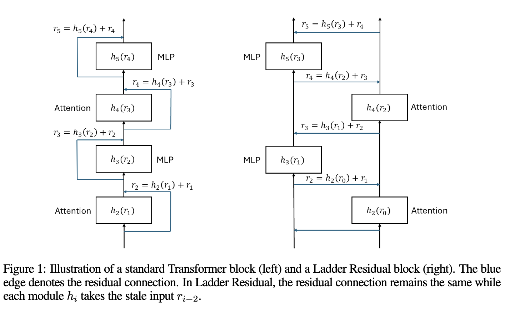

# Ladder-Residual-Inference
This repository contains the code for the paper [Ladder Residual: Redifining Tensor Parallelism in Transformers for Accelerated Inference]().

## Ladder Redisual
Ladder Residual Transformer (or simply Ladder Transformer) is a decoder-based transformer LLM architecture that allows overlapping of computation with communication for inference by model architecture modification. The proposed approach doesn't require any custom kernels making the method easily scalable and applicable to different hardware architectures and ML frameworks.

Large language model inference is both memory-intensive and time-consuming, often
requiring distributed algorithms to efficiently scale. Tensor parallelism (TP) is a
common technique used in multi-gpu training and inference to partition computation
across multiple devices, reducing memory load and computation time. However, such
parallelism necessitates fast interconnects between the devices which has been a major
bottleneck and limits the gains obtained by scaling up the number of devices. We
introduce Ladder Residual, a simple architectural modification applicable to all residualbased models that enable straightforward overlapping that effectively hides the latency
of communication. Our insight is that in addition to systems optimization, one can also
redesign the model architecture to decouple communication from computation. For a
Transformer model of 8B size, applying Ladder Residual to all its layers achieves 29%
end-to-end wall clock speed up at inference time with TP world size of 8 devices. We refer to such model as the Ladder Transformer. We train a 1B and 3B Ladder Transformer
from scratch and observe comparable performance to a standard dense transformer
baseline. We also conduct adaptation experiments for our approach and show that it’s
possible to adapt parts of the Llama-3.1 8B model with minimal accuracy degradation
by only retraining for 3B tokens. To further push the performance frontier, we
propose another architectural modification which drops communications in the model,
unlocking fast LLM inference in settings devoid of NVLink or other fast interconnects.

